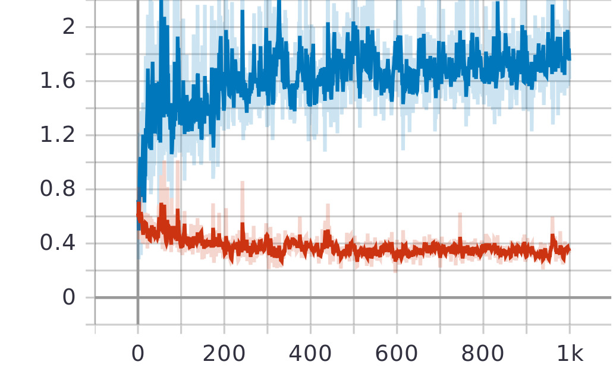
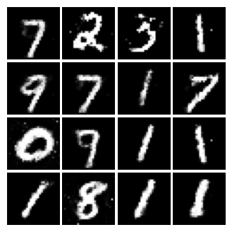
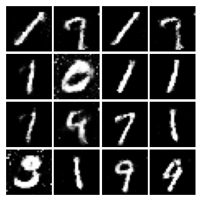

# pytoch-vanilla-GAN
pytorch implementation of vanilla GAN
## GAN
GAN, aka, Generative Adversarial Networks, involves two agents, a generator and a discriminator. The generator serves the purpose of generating images given random noise. The discriminator serves the purpose of dscriminating the true one from the fake. The whole process is a bit like a game where two parties perform adversarial process.
The process formulates as below:
We define generator as G, and discriminator as D.
$$
\min_G \max_D V(D, G) = E_{x \sim P_{data}(x)}[\log D(x)] + E_{z \sim P_z(z)}[\log (1 - D(G(z)))]
$$

## Implementation
To run our code

    python train.py

View on tensorboard

    tensorboard --logdir=runs 

## Experiment and Results

We tested on MNIST and CIFAR10. We use Adam with learning rate of 0.0002, a weight decay of 1e-4 and a batch size of 512 for 1000 epochs. Note, I did not tune the parameters carefully, so the results might seem a bit blurry.

### MNIST
The blue line is the generator loss while the red is discriminator loss

Few of the generated images are as followed:

